# Complete description of current extensions

Dit rapport zal een overzicht bevatten van de opgedane kennis met betrekking tot de methode van Macaulay. Dit rapport is bedoeld voor personen met mechanica kennis die nog onbekend zijn met de methode van Macaulay. In dit rapport zal de methode van Macaulay worden toegelicht en zal er worden aangegeven hoe deze toegepast kan worden.

Dit rapport bestaat uit 4 hoofdstukken:

1.  De methode van Macaulay

2.  Modelleren van krachten, opleggingen en verbindingen

3.  Invloedslijnen met Macaulay

4.  Oplossen van 2D constructies

In dit rapport wordt er gerefereerd naar de werken van {cite:ts}`vanderwulp_2023`, {cite:ts}`jankie_2023`, {cite:ts}`alex_2024` en {cite:ts}`mark_2023` en wordt er hevig gebruik gemaakt van citaties en parafraseringen.

## 1.  De methode van Macaulay

(hoofdstuk_1_1)=
### 1.1 Belastingvergelijking

Uit de balkentheorie van Euler-Bernoulli kunnen de differentiaalvergelijkingen voor buiging {eq}`vgl_1` en extensie {eq}`vgl_2` worden afgeleid. Begrip over de afleiding en het gebruik van deze vergelijkingen wordt als voorkennis beschouwd.

```{math}
:label: vgl_1
EI\frac{d^{4}w}{dx^{4}} + q_{z}
```

```{math}
:label: vgl_2
EA\frac{d^{2}w}{dx^{2}} + q_{x}
```

Over het algemeen worden deze vergelijkingen gebruikt door liggers eerst in verschillende delen met gelijke belasting op te splitsen. Vervolgens kan ieder deel beschreven worden met de differentiaalvergelijking en wordt er gebruik gemaakt van overgangsvoorwaarden.

Bij de methode van Macaulay wordt er op een andere manier gebruik gemaakt van deze differentiaalvergelijkingen. De methode van Macaulay maakt gebruik van singulariteitsfuncties om de belasting op een ligger te beschrijven. Dit heeft als grote voordeel dat een ligger niet opgesplitst hoeft te worden in verschillende delen. Het gedrag van een ligger kan zo in één vergelijking worden beschreven.

### 1.2  Singulariteitsfuncties

Zoals hierboven aangegeven maakt de methode van Macaulay gebruik van singulariteitsfuncties. Dit is een familie van functies die gebaseerd is op de Dirac-delta functie. Het differentiëren en integreren van deze Dirac-delta functie vormt deze familie. De singulariteitsfunctie is wiskundig als volgt gedefinieerd:

Voor $n\  \geq \ 0$:

```{math}
:label: vgl_3
f(x) \equiv < x - a >^{n} = \left\{ \begin{array}{r}
(x - a)^{n}\ \ \ x \geq a \\
0\ \ \ \ \ \ \ \ \ \ \ \ \ \ \ \ \ x < a
\end{array} \right.\
```

Voor $n < \ 0$:

```{math}
:label: vgl_4
f(x) \equiv < x - a >^{n} = \left\{ \begin{array}{r}
0\ \ \ \ x \neq a \\
\infty\ \ \ x = a
\end{array} \right.\ 
```

Hierin geeft $a$ de positie aan waar de singulariteit voorkomt, en is $n$ de orde van de functie.

Het integreren van de singulariteitsfunctie is afhankelijk van zijn orde en is als volgt gedefinieerd:

```{math}
:label: vgl_5
\int_{}^{}{(x - a)^{n}dx} = \left\{ \begin{array}{r}
(x - a)^{n + 1},\ \ n < 0 \\
\frac{(x - a)^{n + 1}}{n + 1}\ \ \ \ \ ,\ \ n \geq 0
\end{array} \right.\
```

De meest voorkomende ordes voor de singulariteitsfunctie zijn van -2 tot 2, waarbij iedere orde een specifieke functie benaming heeft. Deze benamingen zijn in volgorde 'unit doublet', 'unit impulse (Dirac-delta)', 'unit step (Heaviside)', 'unit ramp' en 'unit parabolic'. Deze functies kunnen als volgt worden gevisualiseerd.

***Unit doublet***
```{figure} figures/image1.png
---
width: 400
name: Figuur_1
align: center
---
Unit doublet functie {cite:p}`vanderwulp_2023`
```

***Dirac-delta (Unit impulse)***
```{figure} figures/image2.png
---
width: 400
name: Figuur_2
align: center 
---
Dirac-delta functie {cite:p}`vanderwulp_2023`
```

***Unit step (Heaviside)***
```{figure} figures/image3.png
---
width: 400
name: Figuur_3
align: center
---
Unit step functie {cite:p}`vanderwulp_2023`
```

***Unit ramp***
```{figure} figures/image4.png
---
width: 400
name: Figuur_4
align: center 
---
Unit ramp functie {cite:p}`vanderwulp_2023`
```

***Unit parabolic***
```{figure} figures/image5.png
---
width: 400
name: Figuur_5
align: center
---
Unit parabolic functie {cite:p}`vanderwulp_2023`
```

### 1.3  Oplossingsstrategie

De eerste stap bij het oplossen van een probleem met de methode van Macaulay is het opstellen van de belastingvergelijking. Hiervoor wordt de hele constructie gemodelleerd in één vergelijking. Deze vergelijking kan vervolgens ingevuld worden als $q$ in de differentiaalvergelijkingen in `ref`(hoofdstuk_1_1). Hoe verschillende onderdelen van een constructie gemodelleerd kunnen worden in deze vergelijking is beschreven in `ref`(hoofdstuk_2).

Als de belastingvergelijking is gevonden kan deze geïntegreerd worden. Dit geeft vergelijkingen die de dwarskracht, het moment, de rotatie en de doorbuiging van de staaf beschrijven. In deze vergelijkingen staan nog onbekende reactiekrachten en integratieconstanten.

Om deze onbekende reactiekrachten en integratieconstanten op te lossen kunnen de randvoorwaarden worden opgesteld. Met deze randvoorwaarden kunnen de onbekende waardes worden gevonden.

De gevonden waardes voor de reactiekrachten en integratieconstanten kunnen worden ingevuld in de vergelijkingen. Dit geeft de vergelijkingen die het gedrag van de staaf beschrijven.

(hoofdstuk_2)=
## 2.  Modelleren van belastingen, opleggingen en verbindingen

### 2.1 Modelleren van belastingen

Voor het modeleren van belastingen op de constructie wordt gebruik gemaakt van singulariteitsfuncties. Dit maakt het mogelijk om de volledige constructie in één regel te beschrijven en daarmee de differentiaalvergelijking op te lossen. Er zal nu toegelicht worden hoe verschillende krachten beschreven kunnen worden met singulariteitsfuncties.

Belastingen kunnen worden beschreven door de een singulariteitsfunctie van bijbehorende orde te vermenigvuldigen met de waarde van de kracht of verbinding. Naar aanleiding van het assenstelsel wordt een kracht positief of negatief gemodelleerd.

***Puntlast***
Een puntlast geeft belasting op een enkele plek in de constructie. Een puntlast kan gemodelleerd worden met de Dirac-delta functie. Een puntlast met een waarde $F$, ter plaatse van punt $a$ wordt gemodelleerd in de krachtvergelijking als $F{< x - a >}^{- 1}$.

***Koppel***
Een koppel werkt ook op een enkel punt in de constructie. Een koppel wordt beschreven door de unit doublet in de krachtenvergelijking. Een koppel met waarde $T$ gelegen op punt $a$ wordt gemodelleerd als $T{< x - a >}^{- 2}$.

***Uniform verdeelde belasting***
Belasting die gelijkmatig verdeeld is over de constructie kan beschreven worden met de Heaviside functie. Een uniform verdeelde belasting met waarde $q_{z}$, beginpunt $a$ en eindpunt $b$ kan dan in de krachtvergelijking gemodelleerd worden als $q_{z}{< x - a >}^{0} - q_{z}{< x - b >}^{0}$. Hierbij werkt de waarde van $q_{z}$ vanaf $b$ in tegengestelde richting, dit geeft een totaal van 0. Deze werking is in {numref}`Figuur_6` weergegeven. Wanneer een uniform verdeelde belasting tot het einde van een constructie werkt is het niet nodig om de kracht nog te compenseren. In dat geval kan de kracht gemodelleerd worden als $q_{z}{< x - a >}^{0}$.

```{figure} figures/image6.png
---
width: 600
name: Figuur_6
align: center
---
Modelleren van een uniform verdeelde belasting {cite:p}`vanderwulp_2023`
```

***Lineair en parabolisch verdeelde belastingen*** 
Belastingen die niet uniform maar lineair of parabolisch verdeeld zijn kunnen op eenzelfde manier gemodelleerd worden als de uniform verdeelde belasting.


### 2.2 Modelleren van opleggingen en verbindingen voor buiging

Naast belastingen kunnen ook opleggingen en verbindingen worden gemodelleerd door middel van singulariteitsfuncties. Op de plek waar een oplegging of verbinding wordt toegevoegd gelden ook randvoorwaarden. Deze randvoorwaarden worden gebruikt om de vergelijkingen uiteindelijk op te lossen. Er zal nu worden toegelicht hoe verschillende opleggingen en verbindingen kunnen worden beschreven door middel van singulariteitsfuncties en welke randvoorwaarden daarbij horen. Er wordt in dit hoofdstuk alleen gekeken naar krachten loodrecht op de staaf en momenten. Krachten evenwijdig aan de staaf worden behandeld in het hoofdstuk 2.3 Modelleren van opleggingen en verbindingen voor extensie.

***Inklemming***\
Bij een inklemming kunnen een verticale oplegreactie en een inklemmingsmoment optreden. Zoals beschreven in het hoofdstuk modelleren van belastingen, kunnen deze beschreven worden met singulariteitsfuncties van respectievelijk orde -1 en -2.

Daarnaast introduceert een inklemming ook twee randvoorwaarden. Ter plaatse van een inklemming is de zakking ($w$) en de rotatie ($\varphi$) van de staaf gelijk aan 0.
In {numref}`Figuur_7` is weergegeven hoe een inklemming gemodelleerd kan worden.

```{figure} figures/image7.png
---
width: 400
name: Figuur_7
align: center
---
Modelleren van een inklemming {cite:p}`vanderwulp_2023`
```

***Scharnier- en roloplegging***
Aangezien krachten in de richting van de staaf nog niet worden meegenomen, kunnen scharnier- en rolopleggingen op dezelfde manier worden gemodelleerd. Bij een scharnier- of roloplegging speelt een verticale oplegreactie. Deze oplegreactie kan worden gemodelleerd met een singulariteitsfunctie van orde -1.

Een scharnier- of roloplegging introduceert ook een randvoorwaarde. Ter plaatse van de oplegging is de zakking ($w$) gelijk aan 0.

In {numref}`Figuur_8` is weergegeven hoe een scharnieroplegging gemodelleerd kan worden. Dit is hetzelfde voor een roloplegging.

```{figure} figures/image8.png
---
width: 400
name: Figuur_8
align: center
---
Modelleren van en scharnieroplegging {cite:p}`vanderwulp_2023`
```

***Scharnier***
Scharnierende verbindingen in constructies kunnen worden beschreven met singulariteitsfuncties van orde -3. Dit valt te beredeneren uit het feit dat scharnieren een sprong in de krommingslijn geven, en daar dus orde 0 hebben. Terug differentiëren naar de belasting vergelijking geeft een singulariteitsfunctie van orde -3. Een scharnier gelegen op punt $a$ wordt gemodelleerd als $EI\ \varphi{< x - a >}^{- 3}$. De $\varphi$ staat hier voor de rotatie van het scharnier, ofwel de grote van de sprong in de krommingslijn.

Een scharnier introduceert ook een randvoorwaarde. Ter plaatse van het scharnier is het moment ($M$) gelijk aan 0.

In {numref}`Figuur_9` is weergegeven hoe een scharnier gemodelleerd kan worden.

```{figure} figures/image9.png
---
width: 300
name: Figuur_9
align: center
---
MModelleren van een scharnier {cite:p}`vanderwulp_2023`, correctie {cite:p}`mark_2024`
```


***Schuifscharnier***
Schuifscharnieren in een constructie kunnen worden beschreven met singulariteitsfuncties van orde -4. Zoals roterende scharnieren een sprong geven in de krommingslijn, geven schuifscharnieren een sprong in de doorbuigingslijn. Hieruit volgt dat schuifscharnieren in de belasting vergelijking beschreven worden met een singulariteitsfunctie van orde -4. Een schuifscharnier gelegen op punt $a$ wordt gemodelleerd als $EI\ w_{b}{< x - a >}^{- 4}$. Met $w_{b}$ de grote van de sprong in de doorbuigingslijn.

Een schuifscharnier introduceert ook een randvoorwaarde. Ter plaatse van het schuifscharnier is de dwarskracht ($V$) gelijk aan 0.

In {numref}`Figuur_10` is weergegeven hoe een schuifscharnier gemodelleerd kan worden.

```{figure} figures/image10.png
---
width: 300
name: Figuur_10
align: center
---
MModelleren van een scharnier {cite:p}`vanderwulp_2023`, correctie {cite:p}`mark_2024`
```


***Verende opleggingen***\
Er zijn twee soorten verende opleggingen: verende opleggingen die verticale verplaatsing tegengaan en verende opleggingen die rotatie tegen gaan. In beide gevallen wordt de veer gemodelleerd als kracht ter plaatse van de oplegging in de belasting vergelijking.

Een verende oplegging die verticale verplaatsing tegengaat wordt gemodelleerd als puntlast met een grote van $F_{veer}$. De randvoorwaarde die hier wordt geïntroduceerd is: $w(a) = - \frac{F_{veer}}{K_{w}}.$

Waarin $w(a)$ de zakking is ter plaatse van $a$ en $K_{w}$ de veerconstante.

Een verende oplegging die rotatie tegengaat wordt gemodelleerd als koppel met een grote van $M_{veer}$. De randvoorwaarde die hier wordt geïntroduceerd is: $\varphi(a) = - \frac{M_{veer}}{K_{\varphi}}$

Waarin $\varphi(a)$ de rotatie is ter plaatse van $a$ en $K_{\varphi}$ de veerconstante.

In figuur 11 is weergegeven hoe beide veren gemodelleerd kunnen worden.

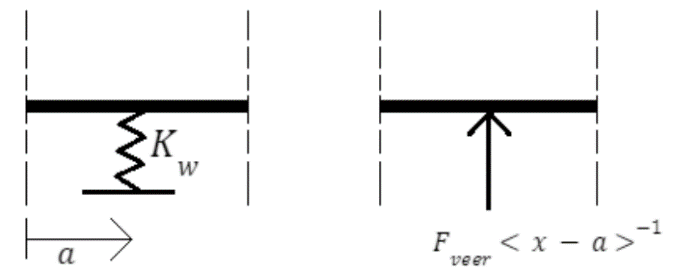\
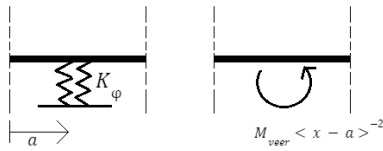\
*Figuur 11: Modeleren van verende opleggingen (Van der Wulp, 2023)*
<br><br><br>

***Verende verbindingen***\
Verende verbindingen worden gemodelleerd als de verbinding waar het om gaat met een andere 
randvoorwaarde.

Voor verende scharnierverbindingen is dit: $𝑀(𝑎) = 𝐾_𝜑 \ 𝜑_𝑣$, met $𝑀(𝑎)$ het moment ter plaatse van punt $𝑎$, $𝐾_𝜑$ de veerconstante en $𝜑_𝑣$ de rotatie van het scharnier.

Voor verende schuifscharnieren is dit: $V(a) = \ K_{w}  \ w_{v}$ , met $V(a)$ de dwarskracht ter plaatse van punt $a$, $\ K_{w}$ de veerconstante en $w_{v}$ verplaatsing ter plaatse van het scharnier.

In figuur 12 is weergegeven hoe beide verende verbindingen gemodelleerd kunnen worden.

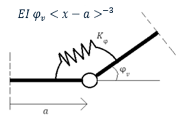
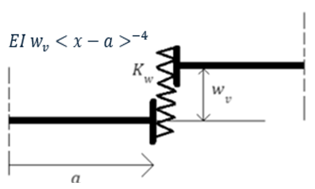

*Figuur 12: Modelleren van verende verbindingen (Van der Wulp, 2023), correctie (Van Gelder, 2024)*
<br><br><br>

### 2.3 Modelleren van opleggingen en verbindingen voor extensie

In het hoofdstuk 2.2 Modelleren van opleggingen en verbindingen voor buiging is gekeken naar hoe opleggingen en verbindingen die spelen bij krachten loodrecht op de staaf en momenten gemodelleerd kunnen worden. In dit hoofdstuk zal gekeken worden hoe opleggingen en verbindingen gemodelleerd kunnen worden bij krachten evenwijdig aan de staaf.

Belastingen kunnen bij extensie op dezelfde manier gemodelleerd worden als bij buiging.

***Opleggingen***\
Bij krachten evenwijdig aan de staaf worden alleen opleggingen gemodelleerd die een oplegreactie kunnen hebben in die richting. Een inklemming en scharnieropleggingen kunnen altijd een oplegreactie in die richting hebben en worden dus altijd gemodelleerd. Een roloplegging wordt enkel gemodelleerd als de rol niet kan verplaatsen in de richting evenwijdig aan de staaf.

De oplegreactie evenwijdig aan de staaf wordt gemodelleerd als puntlast. Bij de oplegging speelt een extra randvoorwaarde, namelijk dat de axiale verplaatsing $(u)$ gelijk is aan 0.

In figuur 13 is weergegeven hoe een scharnieropleggingen gemodelleerd kan worden. Voor andere opleggingen met een oplegreactie evenwijdig aan de staaf gaat dit op dezelfde manier.

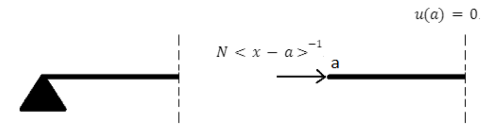\
*Figuur 13: Modelleren van een scharnieroplegging bij extensie (Van der Wulp, 2023)*
<br><br>

***Telescoopscharnieren***\
Deze scharnieren hebben axiale verplaatsing als vrijheidsgraad. Dit geeft een sprong in de vergelijking voor axiale verplaatsing ter plaatse van het scharnier. Deze spong kan gemodelleerd worden met de Heaviside functie. Terug differentiëren naar de belastingvergelijking geeft dan een singulariteitsfunctie met orde -2.

Het telescoopscharnier introduceert ook een extra randvoorwaarde. Ter plaatse van het telescoopscharnier is de normaalkracht $(N)$ gelijk aan 0.

In figuur 14 is weergegeven hoe een telescoopscharnier gemodelleerd kan worden.

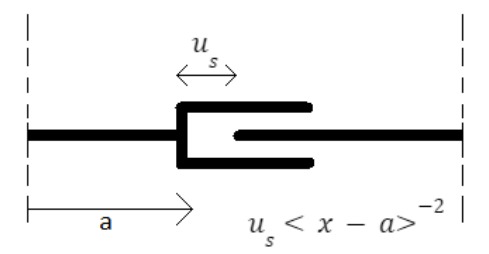\
*Figuur 14: Modelleren van telescoop scharnieren (Van der Wulp, 2023)*
<br><br>

***Verende opleggingen***\
Net als gewone opleggingen bij normaalkracht worden verende opleggingen gemodelleerd met een puntlast. De randvoorwaarde die hierbij speelt veranderd.
Een verende oplegging die axiale verplaatsing tegengaat wordt gemodelleerd als puntlast met een grote van $F_{veer}$. De randvoorwaarde die hier wordt geïntroduceerd is: $u(a) = - \frac{F_{veer}}{K_{u}}.$

Waarin $u(a)$ de axiale verplaatsing is ter plaatse van $a$ en $K_{u}$ de veerconstante.

In figuur 15 is weergegeven hoe een verende scharnieropleggingen gemodelleerd kan worden. Andere verende opleggingen die axiale verplaatsing tegengaan kunnen op dezelfde manier worden gemodelleerd.

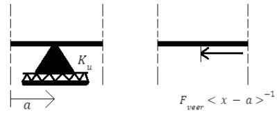\
*Figuur 15: Modelleren van een verende scharnieroplegging bij extensie (Van der Wulp, 2023)*
<br><br>

***Verende verbinding***\
Een telescoopscharnier kan verend gedrag hebben. Het kan dan gemodelleerd worden als verende verbinding. Hierbij wordt het scharnier nogsteeds gemodelleerd als singulariteitsfunctie van orde -2. De randvoorwaarde veranderd wel.

Voor verende telescoopscharnieren wordt deze randvoorwaarde: $N(a) = \ K_{u} \ u_{v}$ , met $N(a)$ de normaalkracht ter plaatse van punt $a$, $\ K_{u}$ de veerconstante en $u_{v}$ de axiale verplaatsing in het scharnier.

In figuur 16 is weergegeven hoe een verend telescoopscharnier gemodelleerd kan worden.

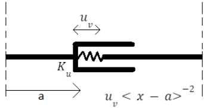\
*Figuur 16: Modelleren van verende telescoopscharnieren (Van der Wulp, 2023)*
<br><br>

## 3.  Invloedslijnen met Macaulay

De methode van Macaulay kan worden gebruikt om invloedslijnen te berekenen. In dit hoofdstuk zal worden toegelicht hoe de methode hierbij kan worden ingezet. Hierbij zal de focus liggen op de basis van invloedslijnen met Macaulay, door te beschrijven hoe invloedslijnen berekend kunnen worden voor eendimensionale constructies.

***Methode***\
De eerste stap voor het berekenen van invloedslijnen met de methode van Macaulay is het beschrijven van de krachtsverdeling op de ligger. Hierbij worden alle krachten die op de ligger spelen gedefinieerd op een positie $x$, waarin $x$ de variabele is die de positie op de ligger beschrijft. De puntlast waarvoor de invloedslijnen worden bepaald wordt gedefinieerd op een positie $x = a$. Deze methode is weergegeven in figuur 17.

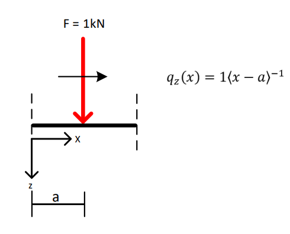\
*Figuur 17: Methode voor invloedslijnen met Macaulay (Jankie, 2023)*
<br>

Vervolgens kan de belastingvergelijking worden geïntegreerd naar $x$. Dit zal resulteren in vergelijkingen met onbekende reactiekrachten en integratieconstanten.

De randvoorwaarden kunnen worden opgesteld. Deze worden gebruikt om de onbekende reactiekrachten en integratieconstanten uit de vergelijkingen op te lossen.

Invullen van de gevonden waardes voor de onbekenden in de geïntegreerde belastingvergelijking resulteert in de gewenste functies. Deze functies hangen af van $x$ en $a$. Waarin voor $x$ een positie op de ligger ingevuld kan worden en $a$ de locatie van de puntlast beschrijft. Zo kan de invloed van een puntlast op locatie $a$ op de staafeigenschappen op locatie $x$ worden bepaald.

## 4.  Oplossen van geknikte, vertakte en gesloten constructies

De Macaulay methode kan worden uitgebreid zodat het ook toepasbaar is op tweedimensionale, inclusief geknikte, vertakte en gesloten, constructies. De belangrijkste sterktepunten van het model zijn dat het systematisch en robuust is doordat het is gebaseerd op de principes van evenwicht en continuïteit, de snedekrachten en verplaatsingen van elk punt kunnen worden bepaald doordat de functie continue is en dat de oplossingsvoorwaarden geringer in tal en eenvoudiger zijn dan voor de traditionele integratiemethode.

### 4.1 Assenstelsel

Het model maakt gebruik van een globaal en een lokaal assenstelsel. Het globale assenstelsel bestaat uit een horizontale en een verticale as waarbij de positieve richtingen naar rechts en naar beneden wijzen. Het lokale assenstelsel bestaat uit een x-as en een z-as. De positieve x-as wordt afgebeeld met een blauwe pijl zichtbaar in Figuur 18 en de positieve z-as is altijd een kwartslag met de klok mee t.o.v. de positieve x-as.

De externe krachten en de verplaatsingen worden globaal genoteerd en de snedekracht-diagrammen lokaal. Er zijn twee vergelijkingen die de lokale as volgen. $q_{z}(x)$ is voor de krachten loodrecht op de staaf en integreert naar de dwarskrachtenvergelijking, enz. en $q_{x}(x)$ is voor de krachten parallel aan de staaf en integreert naar de normaalkrachtenvergelijking, enz.

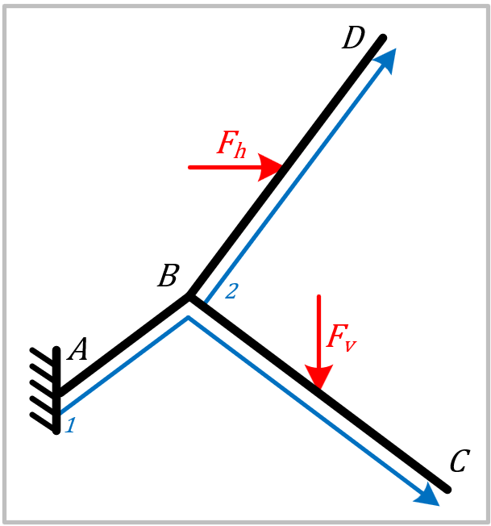\
*Figuur 18: Positieve assen in constructie (Baudoin, 2024)*
<br><br>

### 4.2 Modelleren van belastingen

De belastingen worden in 2D anders gemodelleerd dan in 1D. Er wordt in het model onderscheid gemaakt tussen een scharnier ($\varphi_{s}$), koppel ($T$), horizontale en verticale puntlast ($F_{h}\ en\ F_{v}$) en horizontale en verticale gelijkmatig verdeelde belasting ($q_{h}\ en\ q_{v}$). De vergelijking voor elke belasting is anders voor $q_{z}(x)$ en $q_{x}(x)$ en bestaan telkens uit een beginterm voor het aangrijppunt van de belasting en een systematische reeks hoektermen voor elke hoek waar de functie van $x$ langs gaat na het aangrijppunt van de belasting. De beginterm is telkens vergelijkbaar met de term voor 1D en de hoektermen zijn bepaald door te analyseren wat de invloed is van een hoek op de snedekrachtdiagrammen van een belasting.

In het volgende stuk is $b$ de afstand langs de x-as tot het begin-/aangrijppunt van de belasting, $a_{i}$de afstand langs de x-as tot hoekpunt $i$, $\theta_{b}$ de hoek van de positieve horizontale as naar de positieve x-as op punt $b$ en $\theta_{i}$ op punt $i$.

***Koppel***\
Een koppel heeft geen invloed op de normaal- en dwarskrachten. Verder blijft het buigend moment van een koppel onveranderd bij een knikpunt. Daarom volgen vgl. 1 en 2.

$q_{z}(x) = T\left\langle x - b \right\rangle^{- 2}$ (1)

$q_{x}(x) = 0$ (2)

***Puntlast***\
Bij de normaal- en dwarskrachtenlijn van een puntlast ontstaat een sprong als de functie een hoekpunt passeert. Tegelijkertijd ontstaat er een knik in de momentenlijn als de functie een hoekpunt passeert. Deze sprong en knik ontstaan door de verandering van de projectie van de puntlast. Daarom volgen vgl. 3 t/m 6.

$q_{z}(x) = F_{v}\left( \left\langle x - b \right\rangle^{- 1}\cos\left( \theta_{b} \right) + \sum_{}^{}\left( \left\langle x - a_{i} \right\rangle^{- 1}\left( \cos\left( \theta_{i} \right) - \cos\left( \theta_{i - 1} \right) \right) \right) \right)\ ;\ \ voor\ a_{i} > b$ (3)

$q_{z}(x) = F_{h}\left( \left\langle x - b \right\rangle^{- 1}\sin\left( \theta_{b} \right) + \sum_{}^{}\left( \left\langle x - a_{i} \right\rangle^{- 1}\left( \sin\left( \theta_{i} \right) - \sin\left( \theta_{i - 1} \right) \right) \right) \right)\ ;\ \ voor\ a_{i} > b$ (4)

$q_{x}(x) = - F_{v}\left( \left\langle x - b \right\rangle^{- 1}\sin\left( \theta_{b} \right) + \sum_{}^{}\left( \left\langle x - a_{i} \right\rangle^{- 1}\left( \sin\left( \theta_{i} \right) - \sin\left( \theta_{i - 1} \right) \right) \right) \right)\ ;\ \ voor\ a_{i} > b$ (5)

$q_{x}(x) = F_{h}\left( \left\langle x - b \right\rangle^{- 1}\cos\left( \theta_{b} \right) + \sum_{}^{}\left( \left\langle x - a_{i} \right\rangle^{- 1}\left( \cos\left( \theta_{i} \right) - \cos\left( \theta_{i - 1} \right) \right) \right) \right)\ ;\ \ voor\ a_{i} > b$ (6)

***Gelijkmatig verdeelde belasting***\
Bij de normaal- en dwarskrachtenlijn van een uniform verdeelde belasting ontstaat zowel een sprong als een knik als de functie een hoekpunt passeert. De knik ontstaat door de verandering van de projectie van de verdeelde belasting. De sprong daarentegen ontstaat door een verandering in de projectie van de arbitrale belasting vervangend puntlast. Daarom volgen vgl. 7 t/m 10.

$$q_{z}(x) = q_{v}\left( \left\langle x - b \right\rangle^{0}\cos\left( \theta_{b} \right)\  + \sum_{}^{}\left( \left( {\left\langle x - a_{i} \right\rangle}^{0} + \left\langle x - a_{i} \right\rangle^{- 1}\left( a_{i} - b \right) \right)\left( \cos\left( \theta_{i} \right) - \cos\left( \theta_{i - 1} \right) \right) \right) \right);\ \ voor\ a_{i} > b$$

\(7\)

$$q_{z}(x) = q_{h}\left( \left\langle x - b \right\rangle^{0}\sin\left( \theta_{b} \right) + \sum_{}^{}\left( \left( {(\left\langle x - a_{i} \right\rangle}^{0} + \left\langle x - a_{i} \right\rangle^{- 1}\left( a_{i} - b \right) \right)\left( \sin\left( \theta_{i} \right) - \sin\left( \theta_{i - 1} \right) \right) \right) \right)\ \ ;\ \ voor\ a_{i} > b$$

\(8\)

$$q_{x}(x) = - q_{v}\left( \left\langle x - b \right\rangle^{0}\sin\left( \theta_{b} \right) + \sum_{}^{}\left( \left( {(\left\langle x - a_{i} \right\rangle}^{0} + \left\langle x - a_{i} \right\rangle^{- 1}\left( a_{i} - b \right) \right)\left( \sin\left( \theta_{i} \right) - \sin\left( \theta_{i - 1} \right) \right) \right) \right)\ \ ;\ \ voor\ a_{i} > b$$

\(9\)

$$q_{x}(x) = q_{h}\left( \left\langle x - b \right\rangle^{0}\cos\left( \theta_{b} \right) + \sum_{}^{}\left( \left( {(\left\langle x - a_{i} \right\rangle}^{0} + \left\langle x - a_{i} \right\rangle^{- 1}\left( a_{i} - b \right) \right)\left( \cos\left( \theta_{i} \right) - \cos\left( \theta_{i - 1} \right) \right) \right) \right)\ \ ;\ \ voor\ a_{i} > b$$

\(10\)

***Scharnier***\
Een scharnier heeft geen directe invloed op de snedekrachtdiagrammen, maar zorgt voor een sprong in de hoekverdraaiingsdiagram en een knik in de doorbuigingsdiagram. Daarom gelden vgl. 11 en 12. Hierin is $\varphi_{s}$ een onbekende. Om voor deze onbekende op te lossen moet gesteld worden dat $M(b) = 0$.

$q_{z}(x) = EI\varphi_{s}\left\langle x - b \right\rangle^{- 3}$ (11)

$q_{x}(x) = 0$ (12)


### 4.3 Vergelijking voor horizontale en verticale verplaatsingen

De doorbuiging ($u_{z}(x)$) en extensie ($u_{x}(x)$) zijn voor tweedimensionale constructies hele abstracte termen die niet bruikbaar zijn voor de oplossingsvoorwaarden. Daarom moeten ze worden gebruikt als invoer voor de vergelijkingen van de horizontale en verticale verplaatsing van de constructie ($u_{h}(x)$ en $u_{v}(x)$). De vergelijkingen stellen telkens dat de invloed van de doorbuiging en extensie van een staaf $ij$ ($u_{z,ij}(x)$ en $u_{x,ij}(x)$) op $u_{z}(x)$ en $u_{z}(x)$ gelijk aan nul is als $x < a_{i}$, een functie is als $a_{i} \leq x < a_{j}$ en constant is als $a_{j} \leq x$. Dit wordt afgebeeld in Figuur 19 en Figuur 20. Vervolgens worden $u_{z,ij}(x)$ en $u_{x,ij}(x)$ vermenigvuldigd met een functie van de hoek van de staaf wat tot slot voor alle staven wordt opgesomd. Hieruit ontstaan vgl. 13 en 14.

$u_{v}(x) = u_{z}(0)\cos\left( \theta_{0} \right) - u_{x}(0)\sin\left( \theta_{0} \right) +$
$\sum_{i = 0}^{i = n}\begin{pmatrix}\left( \left( u_{z}(x) - u_{z}\left( a_{i} \right) \right)\left\langle x - a_{i} \right\rangle^{0} - \left( u_{z}(x) - u_{z}\left( a_{j} \right) \right)\left\langle x - a_{j} \right\rangle^{0} \right)\cos\left( \theta_{i} \right) \\ - \left( \left( u_{x}(x) - u_{x}\left( a_{i} \right) \right)\left\langle x - a_{i} \right\rangle^{0} - \left( u_{x}(x) - u_{x}\left( a_{j} \right) \right)\left\langle x - a_{j} \right\rangle^{0} \right)\sin\left( \theta_{i} \right) \end{pmatrix}$ (13)

$u_{h}(x) = u_{z}(0)\sin\left( \theta_{0} \right) + u_{x}(0)\cos\left( \theta_{0} \right) +$
$\sum_{i = 0}^{i = n}\begin{pmatrix} \left( \left( u_{z}(x) - u_{z}\left( a_{i} \right) \right)\left\langle x - a_{i} \right\rangle^{0} - \left( u_{z}(x) - u_{z}\left( a_{j} \right) \right)\left\langle x - a_{j} \right\rangle^{0} \right)\sin\left( \theta_{i} \right) \\+ \left( \left( u_{x}(x) - u_{x}\left( a_{i} \right) \right)\left\langle x - a_{i} \right\rangle^{0} - \left( u_{x}(x) - u_{x}\left( a_{j} \right) \right)\left\langle x - a_{j} \right\rangle^{0} \right)\cos\left( \theta_{i} \right)
 \end{pmatrix}$ (14)

\
*Figuur 19: De invloed van $𝑢_{𝑥,𝑖𝑗}(𝑥)$ op $𝑢_𝑥(𝑥)$ (Baudoin, 2024)*
<br>

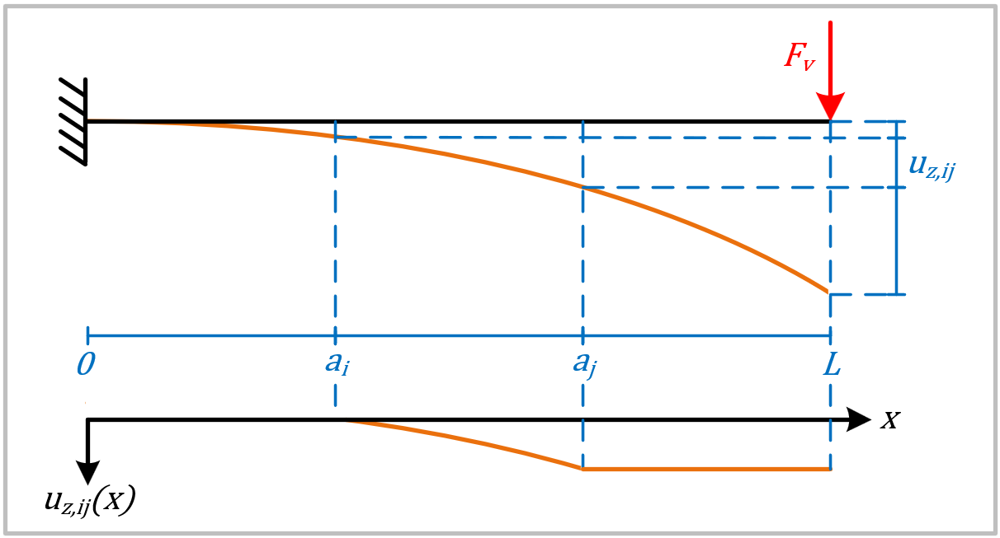\
*Figuur 20: De invloed van $𝑢_{𝑧,𝑖𝑗}(𝑥)$ op $𝑢_𝑧(𝑥)$ (Baudoin, 2024)*
<br><br>

### 4.4 Vertakte en gesloten constructies

Met de tot nu toe in dit hoofdstuk verstreken informatie kunnen geknikte constructies worden gemodelleerd met de Macaulay methode. Om vertakte en gesloten constructies te kunnen modelleren komt er wat benodigde informatie bij, zoals het modelleren van een knooppunt, sprongpunt en aansluitpunt. Dit wordt hier uitgelegd.

***Knooppunt***\
Stel de functie van $x$ gaat over een knooppunt $i$ dan moeten er per staaf waar de functie niet direct overheen gaat drie belastingen ($V^{ij}$, $H^{ij}$ en $T^{ij}$) toegevoegd worden. Hierin vertegenwoordigd $V^{ij}$ de verticale kracht, $H^{ij}$ de horizontale kracht en $T^{ij}$ de koppel voortkomend uit staaf $ij$ werkend op knooppunt $i$. Als staaf $ij$ scharnierend is verbonden aan knooppunt $i$, dan hoeft $T^{ij}$ niet toegevoegd te worden. Deze belastingen worden later weer verwijderd als de functie over de staaf gaat op het knooppunt. Het maakt niet uit of de richting van de functie van knooppunt naar staaf is (zoals bij vertakt) of andersom (zoals bij gesloten).

***Sprongpunt***\
De functie kan ook een sprong maken in het globale assenstelsel. Hiervoor gelden de volgende regels:

-   De functie kan alleen een sprong maken als alle drie de snedekrachtdiagrammen gelijk zijn aan nul en ook nul zouden blijven als er geen sprong wordt gemaakt. Dit is het geval op een eindpunt van een vertakking en de afsluiting van een gesloten sectie nadat $V^{ij}$, $H^{ij}$ en $T^{ij}$ zijn weggehaald.

-   De functie kan alleen springen naar een willekeurig knooppunt waar het al eerder langs is geweest.

-   De functie kan maar één keer over dezelfde staaf verlopen.

-   Bij elke sprong moeten er drie sprongconstanten ($\varphi^{ij}$, $u_{v}^{ij}$ en $u_{h}^{ij}$) worden bijgevoegd om het verschil in vervorming tussen twee punten te overbruggen. Hierbij werkt $\varphi^{ij}$ op $q_{z}(x)$ en werken $u_{v}^{ij}$ en $u_{h}^{ij}$ respectievelijk op $u_{v}(x)$ en $u_{h}(x)$. Als staaf $jk$ scharnieren is verbonden aan punt $j$, dan hoeft $\varphi^{ij}$ niet toegevoegd te worden.

### 4.5 Oplossingsvoorwaarden

In Tabel 1 wordt voorgeschreven welke oplossingsvoorwaarden gelden als lokale afstand $a_{i}$ de benoemde eigenschap heeft. Hierbij is $a_{j}$ de afstand waarbij de functie lokaal voor het eerst langs het globaal zelfde punt komt als afstand $a_{i}$ of $a_{i} + 2dx$. Afstand $a_{i}$ kan meerdere eigenschappen tegelijk hebben, zoals het zijn van een aansluitpunt en sprongpunt waarop een scharnierverbinding plaats vindt.

*Tabel 1: Oplossingsvoorwaarden voor tweedimensionale constructie (Baudoin, 2024)*
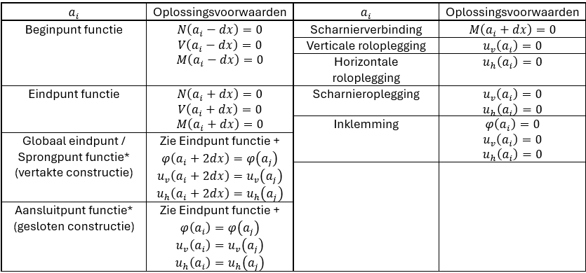\
\* Als de functie springt naar een scharnierend verbonden staaf of scharnierend aansluit op een knooppunt, dan kunnen de oplosvergelijkingen voor de hoekverdraaiing weggelaten worden. Er hoeven dan ook geen alternatieve voorwaarden worden gesteld.
